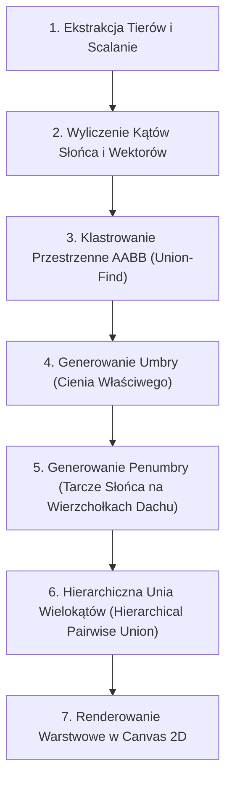

# Architektura i Algorytm Cienia („Nowy” / Soft Shadow) w USI Light

Dokument szczegółowo opisuje krok po kroku działanie **„Nowego” algorytmu cienia (`soft`)** w trybie Masterplan White, w odróżnieniu od podejścia klasycznego (`legacy`).

---

## 1. Wprowadzenie i Koncepcja Matematyczno-Fizyczna

W rzeczywistości fizycznej słońce nie jest punktowym źródłem światła, lecz tarczą o skończonej średnicy kątowej ($\approx 0.53^\circ - 1.25^\circ$). W efekcie rzucany cień dzieli się na:
1. **Umbrę (cień właściwy / pełny)** – obszar, z którego cała tarcza słoneczna jest zasłonięta.
2. **Penumbrę (półcień / miękki brzeg)** – strefę przejściową, gdzie tarcza słońca jest zasłonięta tylko częściowo.

### Porównanie z podejściem obecnym (`legacy`):
- **Obecny (`legacy`)**: generuje 3 niezależne próbki czasu słońca ($t-1\text{ min}$, $t$, $t+1\text{ min}$) jako sztuczne rzuty obrócone o ułamek stopnia i nakłada je na siebie sumą wielokątów.
- **Nowy (`soft`)**: wylicza geometrycznie fizyczny stożek rozmycia zależny od wysokości nad płaszczyzną rzutu ($H$). U podstawy budynku cień jest idealnie ostry, a im wyższy fragment bryły (wierzchołek dachu), tym większe rozproszenie i szerszy margines półcienia ($r_{\text{blur}} = \Delta H \cdot k_{\text{blur}}$).

---

## 2. Architektura Danych i Struktury Wejściowe

1. **`MasterplanStoryTier`**:
   - `polygon`: Wierzchołki rzutu kondygnacji $\mathbb{R}^2$ (`Point2D[]`).
   - `holes`: Otwory wewnętrzne (np. dziedzińce, patio).
   - `hBottom`: Wysokość bezwzględna podstawy kondygnacji [m].
   - `hTop`: Wysokość bezwzględna szczytu kondygnacji/dachu [m].
2. **`SolarAngles`**:
   - `azimuthDeg`, `elevationDeg`: Kąty słońca (Astro lub Linijka Słońca).
   - `sunVector`: Znormalizowany wektor kierunku cienia $[-\sin(\text{azimuth}), -\cos(\text{azimuth})]$.
   - `shadowScale`: Mnożnik długości cienia $\frac{1}{\tan(\text{elevation})}$.
   - `kBlur`: Współczynnik rozmycia stożka półcienia $\frac{\tan(\alpha_{\text{sun}})}{\tan(\text{elevation})}$, gdzie $\alpha_{\text{sun}} = 1.25^\circ$.

---

## 3. Algorytm Krok po Kroku (Step-by-Step)

---

### Krok 1: Ekstrakcja i przygotowanie geometrii (`extractBuildingStoryTiers`)
1. Dla każdego obiektu na scenie pobierane są kondygnacje (`storyPolygons`) lub obrys bazowy (`vertices`).
2. Następuje optymalizacja `collapseIdenticalConsecutiveHeightRuns` – sąsiadujące kondygnacje o identycznym rzucie są łączone w jeden przedział $[h_{\text{Bottom}}, h_{\text{Top}}]$, drastycznie zmniejszając liczbę operacji boolowskich.

---

### Krok 2: Parametry słońca i wektory rzutu (`getMasterplanSolarAngles`)
1. Wyznaczany jest azymut i elewacja dla zadanej godziny (w trybie astronomicznym lub Linijki Słońca).
2. Wyliczany jest wektor kierunku cienia $\vec{d} = (-\sin \theta, -\cos \theta)$ oraz skala cienia:
   $$\text{shadowScale} = \frac{1}{\tan(\text{clampedElevation})}$$
3. Wyliczany jest stały współczynnik rozproszenia tarczy:
   $$k_{\text{blur}} = \tan(1.25^\circ) \cdot \text{shadowScale}$$
4. Wektor przesunięcia szczytu i podstawy:
   $$\vec{v}_{\text{top}} = \vec{d} \cdot (h_{\text{Top}} \cdot \text{shadowScale}), \quad \vec{v}_{\text{base}} = \vec{d} \cdot (h_{\text{Bottom}} \cdot \text{shadowScale})$$

---

### Krok 3: Klastrowanie przestrzenne (`clusterTiersByShadowOverlap`)
1. Dla każdego tieru obliczany jest rozszerzony prostopadłościan otaczający (AABB zasięgu cienia):
   $$\text{AABB}_{\text{reach}} = \text{AABB}(\text{footprint}) \cup (\text{AABB}(\text{footprint}) + 1.05 \cdot \vec{v}_{\text{top}})$$
2. Zastosowany jest algorytm **Union-Find (Disjoint-Set)** dla nakładających się AABB.
3. Obliczenia geometryczne i unie wielokątów wykonują się niezależnie per-klaster, eliminując operacje $O(N^2)$ w silniku `polygon-clipping`.

---

### Krok 4: Wyznaczenie cienia właściwego (Umbra)
Dla każdego tieru w klastrze (`computeStoryShadowPolygonWithHoles`):
1. **Dla brył wypukłych**:
   - Wyznaczana jest bezpośrednia otoczka wypukła (Convex Hull) punktów:
     $$\text{Hull}\left( \{ p_i + \vec{v}_{\text{base}} \} \cup \{ p_i + \vec{v}_{\text{top}} \} \right)$$
2. **Dla brył wklęsłych**:
   - Wyznaczane są krawędzie sylwetkowe ścian (Silhouette Edges): $\vec{n}_{\text{edge}} \cdot (-\vec{d}) < 0$.
   - Budowane są wstęgi ścienne (Wall Ribbons) łączące krawędź podstawy z krawędzią dachu.
   - Dokonywana jest suma boolowska: Rzut podstawy $\cup$ Rzut dachu $\cup$ Wstęgi ścienne.
3. **Obsługa dziedzińców i otworów (Holes/Donuts)**:
   - Światło wpadające przez otwór dachowy tworzy plamę na podłożu:
     $$\text{Aperture} = (\text{Hole} + \vec{v}_{\text{base}}) \cap (\text{Hole} + \vec{v}_{\text{top}})$$
   - Cień końcowy to różnica boolowska: $\text{Umbra} = \text{OuterShadow} \setminus \text{Aperture}$.

---

### Krok 5: Wyznaczenie miękkiego brzegu (Penumbra)
Dla każdego tieru (`computeSoftShadowEnvelopeWithHoles`):
1. Obliczany jest promień tarczy rozmycia na wysokości dachu:
   $$r_{\text{blur}} = h_{\text{Top}} \cdot k_{\text{blur}}$$
2. Wokół każdego przesuniętego wierzchołka dachu $(p_i + \vec{v}_{\text{top}})$ generowany jest $N$-kąt foremny (prekalkulowany okrąg jednostkowy z 8 wierzchołkami).
3. **Ścieżka szybka (bryły wypukłe bez dziur)**:
   - Obliczana jest jedna otoczka wypukła ze wszystkich wierzchołków podstawy $(p_i + \vec{v}_{\text{base}})$ oraz wszystkich punktów tarcz słońca na dachu.
   - Odbywa się to bez kosztownych operacji boolowskich polygon-clipping ($O(M \log M)$).
4. **Ścieżka ogólna (bryły wklęsłe / z dziurami)**:
   - Tworzona jest suma boolowska umbry i wszystkich tarcz wierzchołkowych:
     $$\text{Penumbra} = \text{Umbra} \cup \bigcup_i \text{Disc}(p_i + \vec{v}_{\text{top}}, r_{\text{blur}})$$

---

### Krok 6: Hierarchiczne scalanie geometrii (`unionPolygonsWithHolesHierarchical`)
Wielokąty w ramach klastra nie są wrzucane do pojedynczej wieloargumentowej unii, lecz łączone parami w drzewiastej strukturze (poziom po poziomie):
- Redukuje to liczbę punktów przecięcia sweep-line na klatkę i zapobiega degradacji wydajności.

---

### Krok 7: Renderowanie w Canvas 2D
Struktura renderera generuje dwie próbki:
1. **Warstwa 1 – Penumbra**: Rysowana pierwsza jaśniejszym, półprzezroczystym kolorem (np. `rgba(30, 41, 59, 0.08)`).
2. **Warstwa 2 – Umbra**: Rysowana na wierzchu ciemniejszym kolorem (np. `rgba(30, 41, 59, 0.14)`).

Zasada zawierania ($\text{Umbra} \subseteq \text{Penumbra}$) gwarantuje idealne przejście tonalne od ostrej podstawy do miękkiego czubka cienia.

---

## 4. Obsługa Cieni Dachowych i Samocieniowania ($\Delta H$)

W `renderMasterplanRoofs`:
1. Dachy sortowane są rosnąco według $h_{\text{Top}}$.
2. Dla każdego dachu zakładana jest maska `ctx.clip('evenodd')`.
3. Cień rzucany przez wyższe tiery obliczany jest względem płaszczyzny dachu odbierającego:
   $$\Delta h_{\text{Top}} = h_{\text{Top, higher}} - h_{\text{Top, current}}, \quad \Delta h_{\text{Base}} = \max(0, h_{\text{Bottom, higher}} - h_{\text{Top, current}})$$
4. Promień rozmycia na dachu zależy wyłącznie od różnicy wysokości $\Delta h_{\text{Top}}$, co zapewnia idealne zachowanie fizyczne (cień na bliskim dachu jest ostry, na odległym – rozmyty).

---

## 5. System Cache'owania

- **Klucz Cache Gruntu**:
  `algorithm | method | tiersFingerprint | lat | lon | equinox | hourFraction`
- **Klucz Cache Dachu**:
  `algorithm | method | currentH | higherTiersFingerprint | lat | lon | equinox | hourFraction`

Dzięki temu manipulacje widokiem CAD (**pan / zoom / rotacja**) nie wywołują ponownych obliczeń geometrii cienia, a macierz transformacji Canvas 2D sprzętowo rysuje bufor wielokątów.
