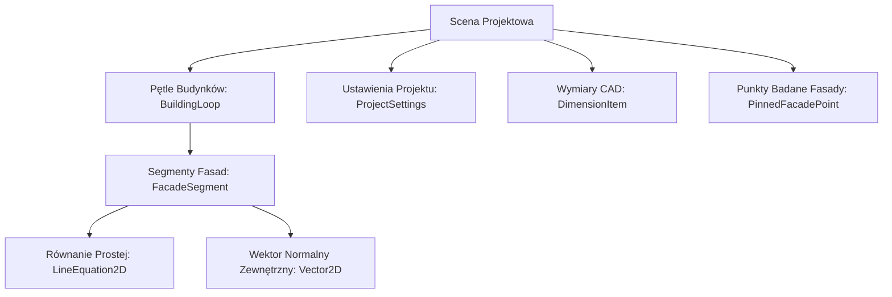

# USI-LIGHT — Kompletna Specyfikacja Architektury, Modułów i Narzędzi

System webowy 2.5D CAD do symulacji i certyfikacji nasłonecznienia (§ 56) oraz przesłaniania (§ 12) zgodnie z Warunkami Technicznymi (Rozporządzenie Ministra Infrastruktury).

---

## 1. Architektura Systemu i Stos Technologiczny

Aplikacja działa w pełni po stronie klienta (Client-Side Only), zapewniając natychmiastowy czas odpowiedzi (interaktywność 60 FPS) przy zachowaniu precyzji analitycznej CAD.

### Stos Technologiczny (Tech Stack)
* **Frontend Core:** React 19, TypeScript (strict mode), Vite 6 / 8.
* **Styling & UI:** Tailwind CSS 3.4, Lucide React (ikony architektoniczne i CAD), `clsx`.
* **Warstwa Renderowania:** Zoptymalizowany podwójny silnik Canvas 2D API (**Dual-Canvas Architecture**):
  * **Base Canvas (`canvasRef`):** bufor podkładowy sceny (siatka, geometrie budynków, cienie rzucane, pasma analityczne § 12 i § 56, wymiary) odświeżany wyłącznie przy zmianie geometrii lub transformacji kamery.
  * **Interactive Overlay Canvas (`overlayCanvasRef`):** niezależna nakładka renderująca kursor, podglądy tworzenia/edycji obiektów, znaczniki OSNAP/OTRACK i linie pomocnicze w pełnej częstotliwości (60/120 FPS) bez narzutu na przerysowywanie geometrii sceny.
  * **Path2D & AABB Viewport Culling:** kompilacja obrysów budynków do zbuforowanych obiektów `Path2D` (WeakMap cache) rysowanych pojedynczym wywołaniem transformacji afinicznej (`setTransform`) oraz automatyczne odrzucanie obiektów poza widocznym kadrem.
* **Wielowątkowość Obliczeniowa:** Web Workers (`analysis.worker.ts` sterowany hookiem `useAnalysisWorker`) z mechanizmem automatycznego fallbacku do wątku głównego oraz dwuetapowym kalkulowaniem LOD (*Progressive Accuracy Refinement*).
* **Struktury Przestrzenne i Algorytmy Geometrii:** 
  * `rbush` – dynamiczne drzewa R-Tree (Spatial Indexing) do przyspieszenia zapytań kolizyjnych.
  * `polygon-clipping` – zaawansowane operacje boolowskie na wielokątach 2D (Union/Difference/Intersection) do wyznaczania kopert i obrysów cieni.
  * Własny moduł 2D Math CAD (`math2d.ts`) – analityczne przecięcia, rzutowania, bezalokacyjny raycasting (`raySegmentDistance2D`), odległości punkt-odcinek, offsety krawędzi i transformacje afiniczne.
* **Parsowanie i Eksport Danych:**
  * `dxf-parser` – odczyt wektorów CAD (`LWPOLYLINE`, `POLYLINE`, `LINE`) z automatyczną detekcją jednostek (m, cm, mm).
  * `jspdf` – generowanie formalnych raportów bilansowych PDF z tabelami i metrykami.
  * Własny eksporter DXF – zapis geometrii oraz warstw analitycznych do formatu AutoCAD DXF R12.
  * `canvas-confetti` – informacja zwrotna o pełnej zgodności projektu z przepisami.

---

## 2. Model Danych i Reprezentacja Geometrii 2.5D

Wszystkie obiekty w scenie reprezentowane są w rzucie 2.5D – dwuwymiarowy wielokąt płaski w układzie współrzędnych kartezjańskich wzbogacony o metadane wysokościowe i parametry prawne.



### Kluczowe Struktury Danych (`src/types/geometry.ts`)

1. **`Point2D` & `Vector2D`**: Podstawowe struktury współrzędnych `{ x, y }`.
2. **`BuildingLoop`**:
   * `id`, `name`, `layer`: Identyfikator, nazwa i warstwa CAD.
   * `isTested`: Flaga określająca, czy budynek jest obiektem badanym (`true`), czy przeszkodą/otoczeniem (`false`).
   * `isIncluded`: Flaga włączenia/wyłączenia obiektu z kalkulacji.
   * `isCityCentre`: Flaga zabudowy śródmiejskiej (§ 12 ust. 5, § 56 ust. 3).
   * `buildingType`: Typ budynku (`residential` | `childcare` | `other`).
   * `defaultHeight`: Wysokość attyki/kalenicy rzucającej cień ($H_{top}$ w metrach).
   * `hWindowBottom`: Poziom odniesienia dolnej krawędzi okna (domyślnie min. $+0.85\text{ m}$).
   * `vertices`: Tablica wierzchołków wielokąta `Point2D[]`.
   * `segments`: Zbiór segmentów fasad `FacadeSegment[]`.
   * `isClockwise`: Zwrot wierzchołków wielokąta (orientacja geometryczna).
   * `groupId`: Identyfikator grupy obiektów powiązanych (ruch synchroniczny).
   * `transform`: Wektor przesunięcia `{ tx, ty }` oraz kąt obrotu `{ rotationDeg }`.
3. **`FacadeSegment`**:
   * `p1`, `p2`: Punkty końcowe segmentu.
   * `normal`: Znormalizowany wektor normalny skierowany na zewnątrz budynku $\vec{n} = (n_x, n_y)$.
   * `length`, `angleRad`: Długość i kąt nachylenia ściany.
   * `hTop`, `hWindowBottom`: Parametry wysokościowe segmentu.
   * `lineEquation`: Postać ogólna prostej $Ax + By + C = 0$, współczynniki kierunkowe, kąt oraz azymut normalnej.
4. **`PinnedFacadePoint`**: Trwały punkt pomiarowy okna/fasady `{ id, buildingId, segmentId, offsetRatio, label }` (P1, P2, P3).
5. **`ProjectSettings`**:
   * `latitude`, `longitude`: Dokładne współrzędne geograficzne (WGS84).
   * `equinoxDate`: Dzień równonocy (`spring` = 21 marca, `autumn` = 23 września).
   * `isCityCentreDefault`: Domyślny status śródmiejski dla nowo tworzonych brył.
   * `samplingInterval`: Krok próbkowania wzdłuż fasady (domyślnie $0.25\text{ m}$).

---

## 3. Silnik Obliczeniowy (`src/engine/`)

Silnik wykonuje równoległą analizę geometryczną przesłaniania i nasłonecznienia, optymalizowaną pod kątem czasu rzeczywistego (przeliczanie w czasie przeciągania myszą).

```
                 Wektor normalny fasady (n) [0°]
                                |
          Kąt skrajny +78°      |      Kąt skrajny -78°
          (12° od lica ściany)  |      (12° od lica ściany)
                     \          |          /
                      \  STOŻEK WIDZENIA  /
                       \     (156°)      /
                        \       |       /
                         \      |      /
    -----[ Fasada ]-------\-----P-----/-------[ Fasada ]-----
    <-- 12° martwa strefa -->       <-- 12° martwa strefa -->
```

### 3.1. Uniwersalny Pre-filtr Przestrzenny (`prefilterObstacleSegments`)
Przed uruchomieniem właściwych analiz każdy punkt pomiarowy $P$ odrzuca segmenty nieistotne:
1. **Odrzucenie AABB (Bounding Box):** Segmenty dalej niż promień maksymalnego zasięgu oddziaływania ($35\text{ m}$ standardowo, $17.5\text{ m}$ śródmieście).
2. **Martwa strefa $12^\circ$ od lica ściany:** Odrzucenie odcinków leżących poza zakresem kątowym $[-78^\circ, +78^\circ]$ względem normalnej fasady $\vec{n}$.
3. **Backface Culling:** Odrzucenie ścian przeszkód zwróconych „tyłem” do punktu $P$ ($\vec{v}_{P \to P_{seg}} \cdot \vec{n}_{seg} \le 0$).

---

### 3.2. Moduł Analizy Przesłaniania (§ 12 WT) — `analyzeShadowingAtPoint`
Analiza wyznacza spełnienie wymogów naturalnego oświetlenia przesłanianego pomieszczenia.

1. **Wymagana odległość graniczna $D_{req}$ dla przeszkody $j$:**
   $$\Delta H = \max(0, H_{top, j} - H_{window\_bottom})$$
   $$D_{base} = \begin{cases} \Delta H & \text{dla } \Delta H \le 35\text{ m} \\ 35\text{ m} & \text{dla } \Delta H > 35\text{ m} \end{cases}$$
   $$D_{req} = \begin{cases} 0.5 \cdot D_{base} & \text{dla zabudowy śródmiejskiej} \\ D_{base} & \text{dla pozostałych lokalizacji} \end{cases}$$
2. **Analityczna metoda przecięć kołowych:**
   * Wyznaczenie analitycznych punktów przecięcia odcinków przeszkód z okręgiem o promieniu $D_{req}$.
   * Rzutowanie widocznych fragmentów przeszkody na kąty biegunowe względem normalnej $\vec{n}$.
   * Przycięcie do stożka roboczego $[-78^\circ, +78^\circ]$.
   * Scalanie przedziałów zasłoniętych $\Omega_{blocked} = \bigcup [start_k, end_k]$ i wyznaczenie sektorów wolnych $\Omega_{free} = [-78^\circ, 78^\circ] \setminus \Omega_{blocked}$.
3. **Kryteria Zgodności z Prawem (§ 12 ust. 1 i ust. 2):**
   * **Reguła Podstawowa (§ 12 ust. 1 pkt 1):** Istnienie co najmniej jednego ciągłego sektora wolnego $\ge 60^\circ$.
   * **Reguła Tolerancji Przeszkody Wąskiej (§ 12 ust. 2):** Dwa wolne sektory rozdzielone przeszkodą o szerokości kątowej $\le 15^\circ$, których łączny kąt otwarcia (wolny 1 + przeszkoda + wolny 2) wynosi $\ge 75^\circ$ (przy sumie kątów wolnych $\ge 60^\circ$).

---

### 3.3. Moduł Analizy Nasłonecznienia (§ 56 WT)

Aplikacja implementuje dwa niezależne, weryfikowane wzajemnie silniki obliczeniowe:

#### Tryb A: Metoda Astronomiczna (Raycasting 3D) — `analyzeSunlightAtPoint`
* Dokładne wyznaczenie pozycji słońca (Azymut $\alpha(t)$, Elewacja $\gamma(t)$) co $k$ minut (np. 5 min w trybie finalnym, 15 min w trybie live).
* Okno czasowe: $T_{peak} \pm 5\text{ h}$ (10 godzin dla mieszkań) lub $T_{peak} \pm 4\text{ h}$ (8 godzin dla przedszkoli/żłobków/szkół).
* Weryfikacja kąta padania promienia słonecznego w rzucie: $\ge 12^\circ$ od płaszczyzny fasady.
* Weryfikacja kąta przesłaniania: $\gamma(t) > \arctan\left(\frac{\Delta H}{d}\right)$ dla wszystkich kolidujących przeszkód.
* Warunek zgodności: $\ge 3.0\text{ h}$ (lub $\ge 1.5\text{ h}$ w zabudowie śródmiejskiej).

#### Tryb B: Metoda Wykreślna Linijki Słońca (Analityczna Segment-Intersection $O(1)$) — `analyzeSunlightAtPointSegments`
* Wdrożenie klasycznej metody wykreślnej doc. Mieczysława Twarowskiego.
* Wyznaczenie płaszczyzny słonecznej E-W o nachyleniu $k = \tan(\text{szerokość geograficzna})$.
* Wyznaczenie analitycznej linii granicznej $y_{line} = P_y - \Delta H \cdot \tan(\phi)$.
* Przycięcie geometrii przeszkód do płaszczyzny rzutu bez dyskretyzacji czasowej.
* Bezpośrednie mapowanie kątów azymutu na czas słoneczny w złożoności $O(1)$.

---

### 3.4. Moduł Koperty i Zasięgu Cienia (Shadow Range) — `computeFullShadowAnalysis`
* Wyznaczanie krawędzi sylwetkowych budynków (*Silhouette Edges*).
* Analityczne rzutowanie wielokątów cienia dla godzin od $-5\text{ h}$ do $+5\text{ h}$ względem południa słonecznego.
* Wyznaczanie łącznej koperty zasięgu cienia (*Shadow Envelope*) z wykorzystaniem operacji boolowskich na wielokątach (`polygon-clipping` Union).

---

### 3.5. Dynamiczna Progresja Dokładności (Progressive LOD Refinement)

| Tryb | Krok Próbkowania Fasady | Krok Kątowy Promieni | Krok Czasowy Słońca | Zastosowanie |
| :--- | :--- | :--- | :--- | :--- |
| **Live (Interaktywny)** | $1.50\text{ m}$ | $1.5^\circ$ | $15\text{ min}$ | W trakcie przeciągania, obracania i edycji (60 FPS) |
| **Final (Spoczynkowy)** | $0.25\text{ m}$ | $0.5^\circ$ | $5\text{ min}$ | Automatycznie po 200 ms bezruchu kursoru |

---

## 4. Narzędzia i Moduły Aplikacji

### 4.1. Narzędzia Rysowania i Modelowania CAD
* **Narzędzie Prostokąt (Rectangle Tool):**
  * Rysowanie prostokątnych brył budynków przez wskazanie dwóch przeciwległych narożników.
  * Automatyczne domykanie pętli, generowanie segmentów i obliczanie wektorów normalnych skierowanych na zewnątrz.
* **Narzędzie Polilinia (Polyline Tool):**
  * Wprowadzanie dowolnych wieloboków budynków punkt po punkcie.
  * Dynamiczny podgląd gumowej linii (*rubber band*), licznik wierzchołków, zamykanie obrysu kliknięciem w punkt startowy lub klawiszem `Enter`.
* **Narzędzie Edycji Wierzchołków (Vertex Edit):**
  * Interaktywne przesuwanie narożników istniejącego budynku z automatycznym przeliczaniem normalnych i długości przyległych fasad.
* **Narzędzie Obrotu Bryły (Rotate Tool):**
  * Obrót zaznaczonego budynku wokół środka ciężkości (lub wybranego pivotu) z precyzyjnym kątem w stopniach.
* **Narzędzie Równoległego Przesuwania Krawędzi (Edge Parallel Edit / Stretch):**
  * Kliknięcie krawędzi budynku i przeciąganie wzdłuż jej normalnej w celu zmiany szerokości/głębokości traktu budynku bez deformacji pozostałych kątów.
* **Grupowanie i Łączenie Obiektów (Link / Group Buildings):**
  * Powiązywanie wielu brył w zespoły urbanistyczne – przesunięcie jednego obiektu synchronicznie transformuje całą grupę.

---

### 4.2. Narzędzia Pomiarowe i Wymiarowania (Dimension Tools)
* **Wymiar Liniowy (Linear Dimension):**
  * Pomiar i ciągłe wyświetlanie najkrótszej odległości prostopadłej między dwiema wybranymi fasadami budynków wraz z liniami pomocniczymi i etykietą wymiarową w metrach.
* **Wymiar Kątowy (Angular Dimension):**
  * Wyznaczanie i wyświetlanie kąta wzajemnego nachylenia ścian w stopniach ($^\circ$).

---

### 4.3. Narzędzia Inspekcji i Punktów Pomiarowych
* **Badane Punkty Fasady (Pinned Facade Points):**
  * Możliwość przypięcia do 3 kluczowych punktów pomiarowych (np. skrajne okna, punkt newralgiczny parteru) oznaczonych jako `P1`, `P2`, `P3`.
  * Punkty te przemieszczają się automatycznie wraz z bryłą budynku i zachowują swoją pozycję na segmencie.
* **Modalny Inspektor Punktu (Point Inspector Modal):**
  * Pełna diagnoza wybranego punktu pomiarowego.
  * **Dla § 12 (Przesłanianie):** Diagram kołowy (wachlarz) z podziałem na sektory wolne, zasłonięte i tolerowane, zestawienie odległości rzeczywistych i wymaganych $D_{req}$.
  * **Dla § 56 (Nasłonecznienie):** Oś czasu minuta po minucie, azymuty i elewacje słońca, wskazanie przeszkód blokujących promienie oraz zestawienie godzinowe.

---

### 4.4. Nawigacja i Kontrola Widoku CAD
* **Interaktywna Róża Wiatrów i Kompas (Compass Rose):**
  * Wizualizacja północy geograficznej, azymutów wschodu, zachodu i południa słonecznego oraz trajektorii słońca w równonoc.
  * Możliwość kliknięcia w kierunki kardynalne (N, S, E, W) lub obrót widoku CAD.
* **Obrót Widoku Projektowego (View Rotation / Orient to Facade):**
  * Obracanie całego rzutu CAD pod dowolnym kątem lub automatyczne wyrównanie rzutu do lica wybranej ściany (klawisze `[` / `]`, reset `0`).
* **Przyciąganie i Precyzja (Snapping Engine):**
  * Przyciąganie do wierzchołków (*Vertex Snap*), krawędzi (*Edge Snap*) oraz siatki modułowej (*Grid Snap*).
  * Blokada osi ortogonalnych (klawisz `Shift` wymuszający idealny ruch wzdłuż osi X/Y).
  * Zoom kółkiem myszy w punkcie kursora, przesuwanie widoku środkowym/prawym przyciskiem myszy lub spacją, funkcja *Dopasuj do widoku (Fit View)*.

---

### 4.5. Menedżer Warstw CAD (Layer Manager)
* Przegląd wszystkich warstw zaimportowanych z DXF lub utworzonych w programie.
* Niezależne przełączniki dla każdej warstwy:
  * **Widoczność (Żarówka / Eye):** Ukrywanie/pokazywanie geometrii.
  * **Blokada (Kłódka / Lock):** Zabezpieczenie przed przypadkowym przesunięciem lub edycją.
  * **Tryb Ducha (Ghost):** Obiekty widoczne jako tło referencyjne, nieklikalne (kliknięcia przenikają do obiektów pod spodem).
  * **Klasyfikacja Warstwy:** Globalne ustawienie obiektów na danej warstwie jako *Badane*, *Przeszkody* lub *Wyłączone z obliczeń*.

---

### 4.6. Geolokalizacja i Konfiguracja Inwestycji
* Wybór z predefiniowanej listy głównych miast Polski (Warszawa, Gdańsk, Wrocław, Kraków, Poznań) z dokładnymi współrzędnymi geograficznymi.
* **Parser Linków i Współrzędnych Google Maps (`geoParser.ts`):**
  * Wklejenie bezpośredniego linku z Google Maps (np. `https://maps.google.com/?q=52.2297,21.0122`), parametrów `@lat,lon` lub współrzędnych tekstowych natychmiast aktualizuje pozycję słońca.
* Wybór równonocy wiosennej (21 marca) lub jesiennej (23 września).
* Globalny lub indywidualny przełącznik zabudowy śródmiejskiej.

---

## 5. Wizualizacja Wyników i Prezentacja CAD

Wyniki obliczeń prezentowane są bezpośrednio na rzucie jako dwuwarstwowe, dynamiczne pasma analityczne odsunięte od lica ścian:

```
+-----------------------------------------------------------------------------+
|               ZEWNĘTRZNE PASMO: NASŁONECZNIENIE § 56 (gradient/godziny)      |
|               WEWNĘTRZNE PASMO: PRZESŁANIANIE § 12 (zielony/czerwony)       |
| ======================[ LICO ŚCIANY BUDYNKU BADANEGO ]==================== |
+-----------------------------------------------------------------------------+
```

### Kod Kolorystyczny Pasma Nasłonecznienia (§ 56)
* Pasmo zewnętrzne (szerokość skalowana zoomem 6–14 px, przezroczystość $\alpha = 0.65$):
  * **Fiolet / Purpura:** $< 1.5\text{ h}$ (niespełnienie wymogu śródmiejskiego i standardowego).
  * **Czerwień / Karmin:** $1.5\text{ h} - 3.0\text{ h}$ (spełnienie w śródmieściu, brak w standardzie).
  * **Pomarańcz / Żółć:** $\ge 3.0\text{ h}$ (pełna zgodność z normą dla mieszkań i dzieci).

### Kod Kolorystyczny Pasma Przesłaniania (§ 12)
* Pasmo wewnętrzne:
  * **Zieleń szmaragdowa (`#10b981`):** Wymóg spełniony (sektor ciągły $\ge 60^\circ$ lub sektor łączony $\ge 75^\circ$ z przerwą $\le 15^\circ$).
  * **Czerwień różana (`#f43f5e`):** Przesłonięcie przekracza dopuszczalną normę.

---

## 6. Moduł Importu, Eksportu i Persystencji Danych

1. **Import CAD (DXF / DWG):**
   * Parsowanie jednostek pliku (`$INSUNITS`) z opcją ręcznego wymuszenia (metry, centymetry, milimetry).
   * Automatyczna rekonstrukcja zamkniętych poligonów z rozbitych linii i polilinii.
   * Automatyczna orientacja wektorów normalnych fasad na zewnątrz obrysu.
2. **Eksport Rysunku DXF:**
   * Generowanie pliku DXF R12 z podziałem na warstwy: obrysy budynków, pasma § 12, pasma § 56, linie wymiarowe, punkty pomiarowe.
3. **Eksport Raportu PDF (jsPDF):**
   * Tabela bilansowa z wykazem budynków, wysokościami, statusami prawnymi, czasem nasłonecznienia i kątami przesłaniania w punktach badanych.
4. **Zapis i Odtwarzanie Sceny (JSON & LocalStorage):**
   * Pełny zrzut stanu aplikacji do pliku `.json` (budynki, ustawienia, warstwy, wymiary, punkty przypięte, obrót widoku).
   * Automatyczna synchronizacja stanu w przeglądarce (`localStorage.getItem('usi-light.scene.v1')`).

---

## 7. Skróty Klawiszowe i Kontrola CAD

| Klawisz | Akcja |
| :--- | :--- |
| **Spacja + Przeciąganie** / **ŚPM** / **PPM** | Przesuwanie widoku CAD (Pan) |
| **Kółko myszy** | Płynny zoom względem pozycji kursora |
| **Shift** (podczas rysowania/przesuwania) | Wymuszenie osi ortogonalnych (Ortho Lock 0° / 90°) |
| **R** | Narzędzie Prostokąt (Rectangle) |
| **P** | Narzędzie Polilinia (Polyline) |
| **V** | Edycja Wierzchołków (Vertex Edit) |
| **E** | Równoległe przesuwanie krawędzi (Edge Parallel Edit) |
| **O** | Obrót zaznaczonego budynku (Rotate) |
| **D** | Narzędzie Wymiarowania Liniowego / Kątowego |
| **[** / **]** | Obrót widoku roboczego o zadany krok |
| **0** (zero) | Reset obrotu widoku do północy (North Up) |
| **F** | Dopasowanie całej sceny do ekranu (Fit View) |
| **Delete** / **Backspace** | Usunięcie zaznaczonego obiektu / punktu / wymiaru |
| **Escape** | Anulowanie bieżącej operacji / odznaczenie obiektu |